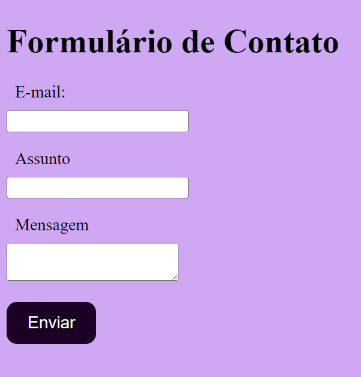

# índice
 

* [form contato](#projeto-de-escrita-de-readme)
* [Descrição](#descrição)
* [Introdução](#introdução)
* [Funcionalidades](#funcionalidades)
* [Tecnologias Utilidades](#tecnologias-utilizadas)
* [Fontes Consultadas](#fontes-consultadas)
* [Autores](#autores)
 

# form-contato
 
## Descrição 📖
-Este projeto é um formulário de contato básico em HTML, criado como parte de um exercício de prática. Ele permite que os usuários preencham informações e enviem mensagens através do formulário. É uma ótima maneira de aprender os conceitos básicos de criação de formulários em HTML.  
  
  

 
## Introdução ✉️
- preenchimento de dados em um formulario de contatos
- 

## Funcionalidades 
- Aprender a construiruma tabela de formularios de contatos

## Tecnologias Utilizadas 🖥️
- visual stude code
-CSS3
-html5
-mdn_
-github

## Fontes Consultadas 🔗
- [mdn web docs_](https://developer.mozilla.org)
## Autores 👥
- naillim novaski
- yasmin luiza
- karem novaski